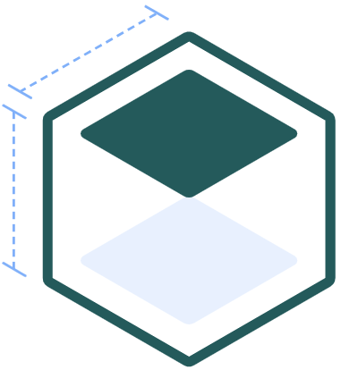

<p align="center">
  
</p>

<h1 align="center">React Breakpoints</h1>

<p align="center">
  
  
  
  <a href="CODE-OF-CONDUCT.md"></a>
</p>

---

`react-breakpoints` allows you to respond to changes in a DOM element's size. You can change the evaluated logic and rendered output of components based on observed size changes in DOM elements. For example, you can change a dropdown menu to a horizontal list menu based on its parent container's width without using CSS media queries.

# 📦 What's in the box?

> No polling. No event listening. No sentinel elements. **Just a [`ResizeObserver`](https://developer.mozilla.org/en-US/docs/Web/API/ResizeObserver)!**

This package provides you with:

- a [`<Provider>`](/docs/api.md#provider) to instantiate the `ResizeObserver`;
- an [`<Observe>`](/docs/api.md#observe) component to observe changes in a DOM element and respond to them.

For power users this package also provides:

- a [`useBreakpoints()`](/docs/api.md#usebreakpoints) hook to change a component's behaviour based on the observed size information in the nearest parent `<Observe>`;
- a [`useResizeObserver()`](/docs/api.md#useresizeobserver) hook to connect a DOM element in your component to the instantiated `ResizeObserver` on `<Provider>`;
- a [`useResizeObserverEntry()`](/docs/api.md#useresizeobserverentry) hook to retrieve the `ResizeObserverEntry` put on the nearest `<Context>`. This is what `useBreakpoints()` uses under the hood.

# 🐉 Be careful using this package when&hellip;

- &hellip;all you want is the low-level API stuff. See [@envato/react-resize-observer-hook](https://github.com/envato/react-resize-observer-hook).
- &hellip;you want _real_ CSS Element Queries. At the end of the day, this is still a JS solution.
- &hellip;you care deeply about [Cumulative Layout Shift](https://web.dev/cls/) on public pages. **Keep reading though, this package may still be of value to you!**

# 🏅 This package is _really good_ at&hellip;

- &hellip;following the latest [draft spec](https://drafts.csswg.org/resize-observer/), giving you access to cutting edge features like `devicePixelContentBoxSize` and [per-fragment](https://drafts.csswg.org/css-break-3/) observation.
- &hellip;performantly observing many elements with a single `ResizeObserver` instance. None of that "a new `ResizeObserver` instance per observed element" bloat that [some](https://github.com/ZeeCoder/use-resize-observer/blob/314b29c33cfcd2c51b8854b775b0a2a5c325d94a/src/index.ts#L151-L157) alternative packages implement.
- &hellip;building highly-responsive private dashboards 📊. One key thing this package (and every other `ResizeObserver` package out there) can contribute negatively to is [Cumulative Layout Shifting](https://web.dev/cls/). At Envato we've had great success using this package on pages that are only visible after signing in, like our Author Dashboard. We've had less success using it in places where search engines can go, on components with responsive styles that changed the layout vertically. One of our company values is "Tell It Like It Is", so we're letting you know to **be mindful of when and how you use `ResizeObserver` for responsive layouts.**

# ⚡️ Quick start

Follow these **minimum required steps** to get started with `react-breakpoints`. This is just the tip of the iceberg, though. Check the [API Docs](/docs/api.md) for all options.

```shell
npm install @envato/react-breakpoints
```

## Wrap your component tree with the provider

```jsx
import { Provider as ResizeObserverProvider } from '@envato/react-breakpoints';

const App = () => <ResizeObserverProvider>...</ResizeObserverProvider>;
```

⚠️ **Caution** — You may need to pass some props to `<Provider>` to increase browser support. Please refer to the [API Docs](/docs/api.md#provider).

## Observe an element and use the results

```jsx
import { Observe } from '@envato/react-breakpoints';

const exampleBreakpoints = {
    widths: {
      0: 'mobile',
      769: 'tablet',
      1025: 'desktop'
    }
  };

export const ExampleComponent = () => (
  <Observe breakpoints={exampleBreakpoints}>
    {({ observedElementProps, widthMatch = 'ssr' }) => (
      <div {...observedElementProps}>
        <div className={widthMatch}>
      </div>
    )}
  </Observe>
);
```

See the [API Docs](/docs/api.md) for reference guides and usage examples.

# Observing vs. Consuming `ResizeObserverSize`

There is an important distinction between the `boxSize` you observe and the `boxSize` you pass to your breakpoints. See [Observing vs. Consuming `ResizeObserverSize`](/docs/boxSizes.md) for more information.

# Re-rendering

Using [`useResizeObserver()`](/docs/api.md#useresizeobserver), [`useResizeObserverEntry()`](/docs/api.md#useresizeobserverentry) or [`useBreakpoints()`](/docs/api.md#usebreakpoints) in your components causes them to re-render **every time a resize is observed**.

In some cases, you may want to optimise this. If you only want to re-render your components when the returned breakpoint values actually change, use `React.useMemo` or `React.memo`.

# Re-rendering

Using [`useResizeObserver()`](/docs/api.md#useresizeobserver), [`useResizeObserverEntry()`](/docs/api.md#useresizeobserverentry) or [`useBreakpoints()`](/docs/api.md#usebreakpoints) in your components causes them to re-render **every time a resize is observed**.

In some cases, you may want to optimise this. If you only want to re-render your components when breakpoint values actually change, use `React.useMemo` or `React.memo`.

# Server-Side Rendering

See [Server-Side Rendering](/docs/server-side-rendering.md) for more information.

# Maintainers

- [Marc Dingena](https://github.com/mdingena) (owner)

# Contributing

For bug fixes, documentation changes, and small features:

1. Fork this repository.
1. Create your feature branch (git checkout -b my-new-feature).
1. Commit your changes (git commit -am 'Add some feature').
1. Push to the branch (git push origin my-new-feature).
1. Create a new Pull Request.

**For larger new features**: Do everything as above, but first also make contact with the project maintainers to be sure your change fits with the project direction and you won't be wasting effort going in the wrong direction.
